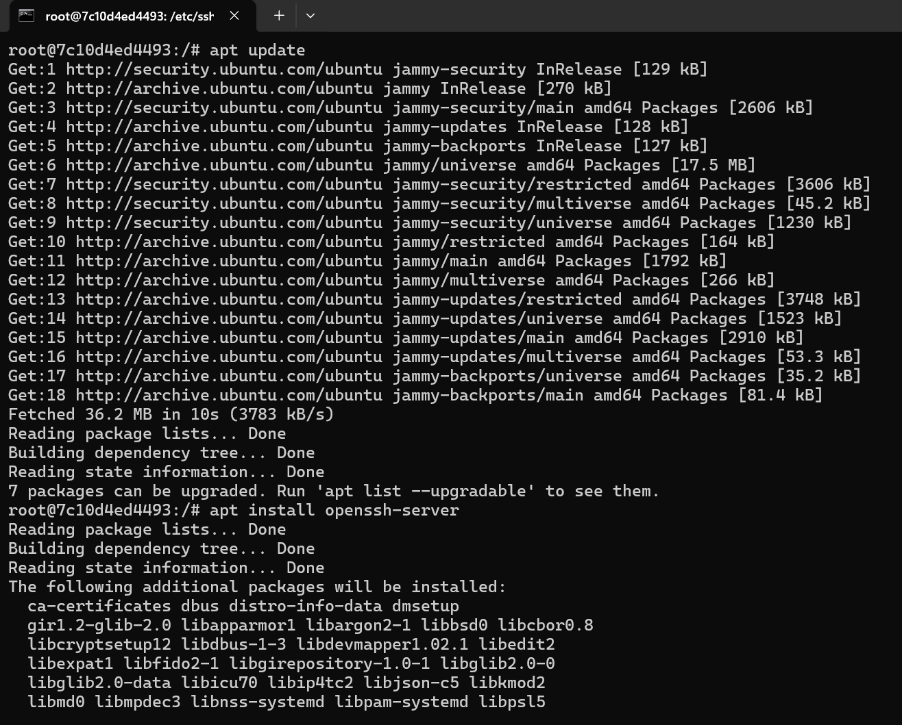
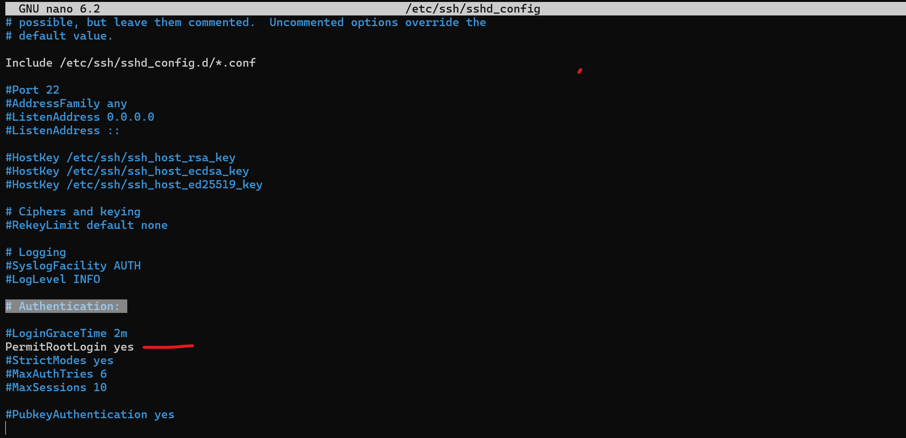
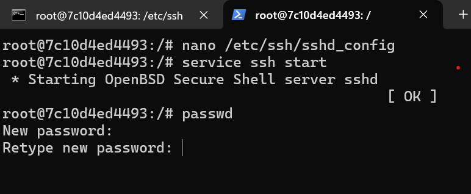

# Project 1: Create SSH Server & Client using Docker

## 📌 Overview
This project demonstrates how to set up an SSH server and client using Docker containers. The SSH server allows secure remote access, and the client container can be used to connect to it.

## 🚀 Getting Started
### Steps to Set Up SSH Server

1⃣ Run Docker Desktop.

2⃣ Open a terminal and run the following command to create and start a new Ubuntu container:
```bash
docker run -it --name container1 ubuntu:22.04
```

3⃣ Inside the container, update package lists:

```bash
apt-get update
```

4⃣ Install OpenSSH Server and Nano editor:

```bash
apt-get install openssh-server -y
apt-get install nano -y
```

5⃣ Edit SSH configuration:

```bash
nano /etc/ssh/sshd_config
```
Under the **Authentication** section, modify:
```plaintext
PermitRootLogin yes
```
Save and exit.

6⃣ Start SSH service:

```bash
service ssh start
```

7⃣ Set a password for root user:
```bash
passwd
```

Enter a new password when prompted.

8⃣ Open a new container2 and install OpenSSH Client: 

```bash
exit
docker run --name container2 ubuntu:22.04
apt-get update -y
apt-get install openssh-client -y
```

9⃣ Find the IP address of container1:
- **Windows:**
```powershell
docker inspect container1 |Select-String "IPAddress"
```
- **Linux:**
```bash
docker inspect container1 |grep IPAddress
```
Copy the IP address.

👏 Connect from container2 to container1 using SSH:
```bash

ssh [IP address of container1]
```

## 📷 Step-by-Step Images
Images for each step can be found in the `images/` directory.

## 🛡️ Stopping & Removing Containers
```bash
docker stop container1 && docker rm container1
```

## 🤝 Contributing
Feel free to open issues or submit pull requests to enhance the project!

## 💜 License
This project is licensed under the [MIT License](../../LICENSE).

Happy Dockering! 🐳

